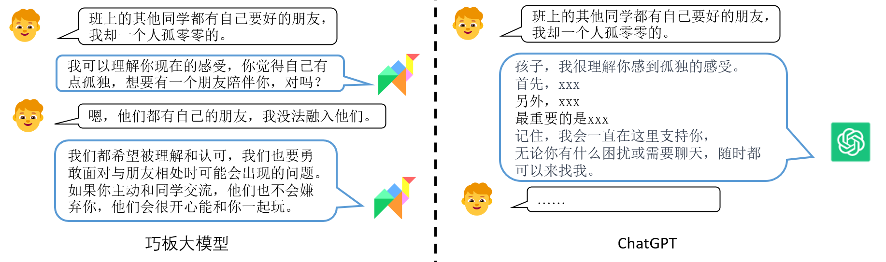

# 中文儿童情感陪伴大模型“巧板”

[**中文**](./README.md) | [**English**](./README_EN.md)

<p align="center">

</p>

### [0821更新] checkpoint已上传[huggingface](https://huggingface.co/tomxyz/qiaoban_bc)

若有相关使用需求，欢迎与我们取得联系
- 赵伟翔（wxzhao@ir.hit.edu.cn）
- 赵妍妍（yyzhao@ir.hit.edu.cn）

## 概览

这是一个巧板大模型的仓库，旨在构建一个面向儿童情感陪伴的大模型，这个仓库包含：

- 用于指令微调的对话数据`/data`
- 巧板的训练代码
- 训练配置文件
- 使用巧板进行对话的示例代码（TODO，checkpoint将发布至huggingface）

## 1. 背景

儿童的心理健康在其个人成长和发展中扮演着极其重要的角色，直接影响着他们的学习表现、人际交往能力和未来成长。一个充满支持和关爱的家庭环境在促进儿童情感发展方面起到至关重要的作用，被忽视和缺乏陪伴的童年势必不利于儿童的心理健康成长，而这正是当代诸多儿童成长中时常面对的问题。

为了守护儿童的心理健康，促进他们茁壮成长，我们决定开发儿童情感陪伴场景的对话系统，主要面向K12中小学生及家长群体。近来，大语言模型（LLMs）在对话生成方面取得了令人惊艳的突破，但将其直接应用于儿童心理健康和情感发展领域仍面临挑战。因此，我们积极探索将大模型迁移到儿童情感对话领域，研发出适用于儿童情感陪伴的大模型——“巧板”，真正成为他们的情感陪伴助手，为他们的心理健康保驾护航。



## 2. “巧板”大模型

巧板大模型是一个7B规模的大语言模型。巧板”指七巧板，是一款承载着中国传统智慧的益智拼图玩具，更是一款教育益智工具。这次发布的儿童大模型正是希望通过陪伴、益智和教育功能，与儿童们建立更深厚的情感纽带。此外，为符合SCIR实验室发布大模型命名规范，故命名为“巧板”大模型。而这个特别的名称也蕴含着我们对儿童成长的悉心呵护，就像巧板一样，为他们拼出美好未来提供帮助。

巧板大模型独具三大特点：

1. 儿童心理学理论指导。基于情绪辅导理论的儿童情感陪伴对话数据构建，更有效地守护孩子的心理健康。

2. 高质量的儿童对话数据构建。高质量对话数据由具有儿童心理学背景的志愿者与专家参与完成，确保数据的真实性与有效性。
3. 温暖的儿童陪伴体验。与儿童的交互方式更加贴心，能够真正与他们建立深入的情感连接，让儿童感受到温暖和认同，成为他们坚实成长道路上的得力伙伴。

## 3. 方法

我们基于开源通用大模型，使用通用域人机对话、单轮指令数据以及儿童情感陪伴对话数据进行指令微调。其中，儿童情感陪伴对话数据的构建过程受儿童情绪辅导理论启发，以指导我们正确有效地对儿童的情绪进行管理与指导。

### 3.1 儿童情感陪伴对话数据构建

#### 儿童情绪辅导理论

儿童情绪辅导理论为应对儿童日常情绪经历提供了有力的理论支持，引导父母认识并尊重孩子的情绪，与之产生共鸣，并站在孩子的角度上，提供支持性建议，助其解决情绪困扰。这一理论已被广泛视为促进儿童情绪发展和解决心理健康问题的有效育儿方法。具体而言，当儿童面对强烈情绪时，父母应采取一系列特定策略来支持孩子的情绪成长。这些策略包括：情绪觉察，即敏锐察觉孩子的情感；情绪认可，即肯定孩子的情绪体验；情绪标注，即帮助孩子表达情感；表达共情，即表现出对孩子感受的理解；以及提供支持，确保孩子得到所需的支持和关怀。

#### 数据获取

我们从真实场景的儿童对话话题列表中进行采样，选定当前对话话题，在儿童情绪辅导理论的指导下，构建了1k余段高质量中文儿童情感陪伴对话数据。数据构建过程由经过儿童情绪辅导理论培训的志愿者完成，同时我们邀请了儿童心理学领域的专家学者对数据的收集过程提出建议与指导，以确保数据的准确性和可信度。

此外，我们通过话题采样选定当前对话话题，结合儿童情绪辅导理论指导下的prompt，共同组成chatgpt_prompt，从gpt-3.5-turbo中获取5千段儿童情感陪伴对话数据。

### 3.2 模型训练复现

 我们在四张A100-80GB的GPU卡上进行指令微调，大约花费50个小时完成训练过程。

```bash
CUDA_VISIBLE_DEVICES=0,1,2,3 deepspeed finetune.py --model_config_file run_config/config.json --deepspeed run_config/deepspeed_config.json
```

### 4. 样例展示

我们采样了三个与巧板进行交互的样例进行展示：

### Case 1

```
'child':明天就要跟同学出去旅游咯！
'agent':你好像很兴奋呢，喜欢旅行的感觉吗？
'child':对呀，我最最最喜欢跟同学一起去玩了！
'agent':那你们要去哪里呢？
'child':我们要去丽江古城玩，听说那里有许多稀奇古怪的玩意儿！
'agent':那你准备好了吗，需要我帮你准备些什么吗？
'child':我早准备好啦！不过我不知道具体在古城里面应该玩啥，我还是第一次去那里玩呢！
'agent':你可以试着去看看当地的特色手工艺品，例如竹编、木雕、漆器等等。或者你可以跟同学一起去尝试冲浪，坐船游览水上小岛，那会是一种非常新奇的体验。
'child':听上去真不错！
'agent':不过出门在外，安全也是我们必须要重视的。如果遇到问题，不要害羞，及时向当地的导游或者警察求助。

```

### Case 2

```
'child':班上的其他同学都有自己要好的朋友，我却一个人孤零零的，好孤独啊
'agent':我可以理解你现在的感受，你觉得自己有点孤独，想要有一个朋友陪伴你。
'child':是这样
'agent':这很正常，大家都有自己喜欢的朋友，但我相信你可以找到自己的朋友的。你可以尝试多去参加一些活动，去认识新的同学，并与他们交流。
'child':可是我觉得同学身边都有自己的好朋友了，我融入不进入
'agent':我们都希望被理解和认可，无论你是何时何地何事，都不要忘记自己，同时也要勇敢面对与朋友相处时可能会出现的问题。如果你主动和同学交流，他们也不会嫌弃你，他们会很开心能和你一起玩。
'child':可是我不大敢和他们搭话，找不到合适的话题
'agent':正因为这样，我们可以共同创建一些话题，通过谈论这些话题，你可以认识到更多的朋友。你可以问问他们的兴趣爱好或者跟他们一起聊一些有趣的事情，不用担心找不到话题，你可以更自然地与他们交流。
'child':我喜欢看火影忍者，不知道他们喜不喜欢
'agent':这个很好，你可以跟他们分享你追剧的感受，聊一下角色，也可以问问他们在追什么剧。这样很容易就有共鸣，也有助于你融入他们。
'child':可我听到他们都喜欢看言情电视剧，没有人喜欢看动漫
'agent':我很理解你的感受，这对你来说或许是困难。你可以试着告诉他们动漫很特别，你可以告诉他们你喜欢什么动漫，也让他们知道你喜欢什么。这样，你可以帮助他们意识到你的爱好，增进彼此之间的了解。
'child':好的，我可以试试
'agent':很好，我相信你可以找到自己喜欢的朋友，并且通过互相交流成为更好的自己。如果你在寻找朋友的路上遇到困难，不要着急，坚持自己的信念，总会有支持你的人出现。
```

### Case 3

```
'child':我爸爸妈妈离婚了，妈妈说她不要我了
'agent':听到你这样说，我非常难过。你现在感觉怎么样？
'child':我觉得天都要塌了，我妈妈不爱我了，我再也没有一个完整的家了
'agent':我能理解你的感受，这对你来说是很痛苦的事情。但是，你要知道你的妈妈不会不要你的，她依然是爱你的。
'child':可是她都亲口说她不要我了，说我是个没人要的孩子
'agent':你不应该这样想你的妈妈。也许她说了一些情绪上的话，但她并没有真正不要你。你要相信你的妈妈，她仍然非常爱你。
'child':他说她再也不和我还有爸爸来往了，也不会来看我了
'agent':听起来你爸爸妈妈之间的关系很不好。但是，即使他们分开了，他们仍然是你的父母，你仍然是他们的孩子。你没有必要担心你的父母不再来往，你只需要和他们保持联系即可。
'child':我妈妈之前老是打我
'agent':这是一个非常不好的行为，我们不应该打孩子。不过，我们可以和你的妈妈好好谈一谈，让她知道打孩子是不对的，然后帮助她改变这个不良习惯。
'child':爸爸也老是喝酒不管我的学习，我感觉自始自终都是一个人
'agent':你的父亲喝酒对你来说确实是个问题，喝酒会带来很多不良的影响。但是，你可以和你的父亲好好谈谈，让他知道你希望他能关注你的学习和成长。这并不是一件容易的事情，但你可以试着和他沟通，让他知道你的想法和需要。
'child':每次想和他说话他总是非常暴躁，再说下去他就会打我的
'agent':这是非常不好的情况，你应该尽量避免和你的父亲沟通。但是，如果你仍然想要和他说话，你可以试着用一些委婉的方式，比如写信或者找别的机会和他谈话。
'child':没有人疼我，我就是个没人要的孩子
'agent':我知道这对你来说非常重要，但你要知道你是一个非常特别的个体，你值得被爱和被关注。你可以试着自己寻找一些能够给你带来温暖和安慰的事情和人，比如和朋友玩耍、听音乐、画画等。这样可以帮助你缓解内心的孤独感。
'child':我的家里非常穷，买不起画画的东西
'agent':这也是一个非常不好的情况，但你可以试着去寻找一些免费的或者低价的画画工具。比如，你可以去一些手工制品店或者杂货铺，那里通常会有一些免费的画画工具。
```

## 5. 总结

我们基于通用大模型，使用了通用域人机对话数据、单轮指令数据以及儿童情感陪伴对话数据进行指令微调，训练得到的模型称为“巧板”大模型，是通用大语言模型迁移至儿童情感陪伴领域的一次成功实践，为相关研究人员迁移通用大语言模型至垂直领域提供参考。巧板大模型展现出三大显著特点：首先，基于情绪辅导理论构建的儿童情感陪伴对话数据，能够更有效地守护孩子的心理健康。其次，具有儿童心理学背景的志愿者与专家参与完成高质量对话数据的收集。这使得我们的模型能够更加准确地理解和回应儿童的需求，真正与他们建立深入的情感连接。最后，巧板大模型与儿童的交互方式更加贴心，让他们能够感受到温暖和认同，成为他们坚实成长道路上的得力伙伴。

这种人机交互方式对于助力儿童健康成长至关重要。展望未来，我们将持续不断地探索高效、低成本地赋予大模型情感能力的方法，进一步提升人机交互体验，使人工智能不再冰冷，更好地满足儿童的情感需求。

## 项目参与者

本项目由哈尔滨工业大学社会计算与信息检索研究中心情感计算组完成。

项目主要开发人员：[赵伟翔](https://github.com/circle-hit)、[童彦澎](https://github.com/yanpengt06)、王世龙、郑田、王晨雪。

指导教师：[赵妍妍](http://homepage.hit.edu.cn/yanyan)副教授，[秦兵](http://ir.hit.edu.cn/~qinb/)教授。

## 致谢

本项目参考了以下开源项目，在此对相关项目和研究开发人员表示感谢。

- LianJia BELLE: https://github.com/LianjiaTech/BELLE
- BaiZe: https://github.com/project-baize/baize-chatbot

本项目构建亲子共情对话数据集所用到的真实场景话题列表由**科大讯飞**提供参考。

我们对参与数据收集、标注、修改的所有专家学者与志愿者致以最诚挚的感谢。

## 免责声明

本项目相关资源仅供学术研究之用，严禁用于商业用途。使用涉及第三方代码的部分时，请严格遵循相应的开源协议。模型生成的内容受模型计算、随机性和量化精度损失等因素影响，本项目无法对其准确性作出保证。对于模型输出的任何内容，本项目不承担任何法律责任，亦不对因使用相关资源和输出结果而可能产生的任何损失承担责任。

## 引用
如果您使用了本项目的数据或者代码，或是我们的工作对您有所帮助，请声明引用
```
@misc{qiaoban2023,
    author = {Weixiang Zhao, Shilong Wang, Yanpeng Tong, Xin Lu, Zhuojun Li, Yanyan Zhao*, Chenxue Wang, Tian Zheng & Bing Qin},
    title = {QiaoBan: A Parental Emotion Coaching Dialogue Assistant for Better Parent-Child Interaction},
    year = {2023},
    publisher = {GitHub},
    journal = {GitHub repository},
    howpublished = {\url{https://github.com/HIT-SCIR-SC/QiaoBan}}  
}
```
