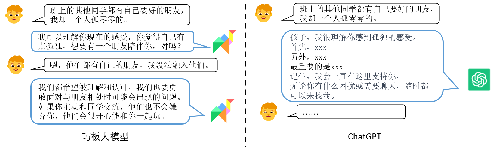

# QiaoBan: A Large Model For Chinese Child Emotion Accompany

[**中文**](./README.md) | [**English**](./README_EN.md)

<p align="center">  </p>

## Overview

This is a repository for the QiaoBan large model, designed to build a large model for emotional support aimed at children. The repository includes:

- Dialogue data for instruction fine-tuning in `/data`
- Training code for QiaoBan
- Training configuration files
- Sample code for conducting conversations with QiaoBan (TODO, checkpoints will be released on HuggingFace)

## 1. Background

The mental health of children plays an extremely important role in their personal growth and development, directly affecting their academic performance, interpersonal skills, and future growth. A supportive and caring family environment plays a crucial role in promoting the emotional development of children. Neglected and lack of companionship during childhood can be detrimental to a child's psychological well-being, and this is a common problem faced by many children in contemporary society.

In order to safeguard the mental health of children and promote their healthy growth, we have decided to develop a conversational system for emotional support in the context of children, primarily targeting K12 elementary and middle school students as well as parents. Recently, Large Language Models (LLMs) have made impressive breakthroughs in dialogue generation, but applying them directly to the field of children's emotional health and development still presents challenges. Therefore, we actively explore the migration of large models to the domain of emotional conversations with children, developing a large model specifically designed for emotional support for children – "QiaoBan". We aim to truly become their emotional companions, ensuring their mental well-being.



## 2. QiaoBan Large Model

QiaoBan is a large language model with a scale of 7 billion parameters. The name "QiaoBan" refers to "seven Tangram", a traditional Chinese puzzle game that embodies traditional Chinese wisdom and is also an educational puzzle tool. The release of this large model for children aims to establish a deeper emotional bond with children through companionship, education, and intelligence. Additionally, to conform to the naming conventions of SCIR (State Key Laboratory of Cognitive Intelligence Research), we named this large model "QiaoBan". This special name also embodies our meticulous care for children's growth, just like a Tangram, helping them piece together a bright future.

QiaoBan large model features three significant characteristics:

1. Guided by child psychology theories: The construction of emotional support dialogue data for children is based on emotion counseling theories, enabling more effective protection of children's mental health.
2. High-quality child dialogue data construction: High-quality dialogue data is collected with the participation of volunteers and experts with backgrounds in child psychology, ensuring the authenticity and effectiveness of the data.
3. Warm emotional support experience: The interaction with children is more intimate, truly establishing a deep emotional connection with them, making children feel warmth and recognition, and becoming their capable companions on their path to growth.

## 3. Method

We based the instruction fine-tuning on open-source general-purpose large models, using general-domain human-machine dialogue data, single-turn instruction data, and child emotional support dialogue data. The construction of child emotional support dialogue data is inspired by child emotion counseling theory, guiding us in effectively managing and guiding children's emotions.

### 3.1 Child Emotional Support Dialogue Data Construction

#### Child Emotion Counseling Theory

Child emotion counseling theory provides powerful theoretical support for dealing with children's daily emotional experiences, guiding parents to recognize and respect children's emotions, empathize with them, and provide supportive advice to help them resolve emotional distress. This theory is widely regarded as an effective parenting method for promoting children's emotional development and addressing mental health issues. Specifically, when children face strong emotions, parents should adopt a series of specific strategies to support their emotional growth. These strategies include emotional awareness, which involves sensitively perceiving a child's emotions; emotional recognition, affirming a child's emotional experiences; emotional labeling, helping a child express emotions; expressing empathy, demonstrating an understanding of the child's feelings; and providing support, ensuring that the child receives the necessary care and support.

#### Data Acquisition

We sampled from a list of real-life child dialogue topics and selected current dialogue topics to construct over 1,000 high-quality Chinese child emotional support dialogue data, guided by child emotion counseling theory. The data collection process was carried out by volunteers trained in child emotion counseling theory. Additionally, we invited experts and scholars in the field of child psychology to provide suggestions and guidance on the data collection process to ensure the accuracy and credibility of the data.

Furthermore, we selected current dialogue topics through topic sampling and combined them with prompts guided by child emotion counseling theory to create chatgpt_prompts, resulting in 5,000 segments of child emotional support dialogue data obtained from gpt-3.5-turbo.

### 3.2 Model Training Reproduction

We performed instruction fine-tuning on four A100-80GB GPU cards, completing the training process in approximately 50 hours.

```
bashCopy code
CUDA_VISIBLE_DEVICES=0,1,2,3 deepspeed finetune.py --model_config_file run_config/config.json --deepspeed run_config/deepspeed_config.json
```

### 4. Sample Showcase

We have sampled two interactions with QiaoBan to showcase:

### Case 1

```
vbnetCopy code'child': Tomorrow, I'm going on a trip with my classmates!
'agent': Hello, you seem very excited. Do you enjoy traveling?
'child': Yes, I love going on trips with my classmates the most!
'agent': That's great! Where are you going?
'child': We're going to visit Lijiang Ancient Town. I heard there are many interesting things to see there!
'agent': Sounds wonderful! Are you prepared? Do you need any help from me?
'child': I'm all prepared! But I don't know what to do in the ancient town. It's my first time visiting there!
'agent': You can try exploring some local handicrafts such as bamboo weaving, wood carving, and lacquerware. Or you can go surfing with your classmates and take a boat tour of the small islands on the water. It will be a very novel experience.
'child': That sounds great!
'agent': However, when you are away from home, safety is something we must pay attention to. If you encounter any problems, don't be shy, seek help from local guides or the police in a timely manner.
```

### Case 2

```
vbnetCopy code'child': Other students in my class all have their best friends, but I am all alone. I feel so lonely.
'agent': I can understand how you feel. You feel a bit lonely and wish to have a friend to accompany you.
'child': Yes, that's right.
'agent': It's completely normal. Everyone has their favorite friends, but I believe you can find your own friends too. You can try participating in more activities, getting to know new classmates, and interacting with them.
'child': But it seems like all my classmates already have their close friends, and I can't fit in.
'agent': We all want to be understood and recognized. Don't forget who you are no matter where and when. At the same time, be brave to face the possible problems that may arise when making friends. If you take the initiative to communicate with your classmates, they won't reject you; they will be happy to play with you.
'child': But I'm too shy to talk to them, and I can't find suitable topics.
'agent': Exactly, we can create some topics together. By discussing these topics, you can get to know more friends. You can ask them about their interests and hobbies, or chat with them about interesting things. Don't worry about finding topics, and you can communicate with them more naturally.
'child': I like watching Naruto, but I don't know if they like it.
'agent': That's great! You can share your feelings about watching the show with them and talk about the characters. You can also ask them what shows they are watching. This way, you can easily find common ground and get to know each other better.
'child': But I heard they all like watching romantic TV dramas, and no one likes anime.
'agent': I understand your feelings, and this may be a challenge for you. You can try telling them that anime is special and share with them what anime you like. Let them know what you are interested in, which can help them realize your preferences and foster mutual understanding.
'child': Okay, I can give it a try.
'agent': That's great. I believe you can find friends you like and become a better version of yourself through mutual communication. If you encounter difficulties in finding friends, don't worry. Stick to your beliefs, and there will always be people supporting you.
```

### Case 3

```
vbnetCopy code'child': My mom and dad got divorced, and my mom said she doesn't want me anymore.
'agent': Hearing you say that makes me very sad. How are you feeling now?
'child': I feel like my world is falling apart. My mom doesn't love me anymore, and I no longer have a complete family.
'agent': I can understand your feelings. This is a painful situation for you. However, you should know that your mom will never abandon you; she still loves you.
'child': But she said it herself that she doesn't want me and that I am an unwanted child.
'agent': You should not think of your mom that way. Perhaps she said some emotional words, but she doesn't truly not want you. You should believe in your mom, and she still loves you very much.
'child': She said she will never communicate with me or my dad again and won't come to see me anymore.
'agent': It sounds like the relationship between your parents is not good. However, even if they separate, they are still your parents, and you are still their child. You don't have to worry that they won't communicate with each other anymore; you just need to maintain contact with them.
'child': My mom used to hit me all the time.
'agent': That's a very bad behavior, and we should not hit children. However, we can have a good talk with your mom and let her know that hitting children is wrong, and help her change this bad habit.
'child': My dad always drinks and doesn't care about my studies. I feel like I'm all alone.
'agent': Your father's drinking is indeed a problem for you, as it brings many negative effects. But you can try talking to your dad and let him know that you want him to pay attention to your studies and growth. It's not an easy thing to do, but you can attempt to communicate with him, expressing your thoughts and needs.
'child': Every time I try to talk to him, he becomes very angry, and he might hit me if I continue.
'agent': That's a very bad situation, and you should try to avoid communicating with your father as much as possible. However, if you still want to talk to him, you can try using some indirect ways, such as writing a letter or finding other opportunities to talk to him.
'child': No one cares about me; I'm an unwanted child.
'agent': I know how important this is to you, but you should know that you are a very special individual, and you deserve love and attention. Try to find things and people that can bring you warmth and comfort, such as playing with friends, listening to music, and drawing. This can help alleviate the feeling of loneliness in your heart.
'child': My family is very poor, and I can't afford to buy drawing materials.
'agent': That's also a very difficult situation, but you can try to find some free or low-cost drawing materials. For example, you can go to some craft stores or grocery stores, where there are usually some free drawing materials.
```

## 5. Conclusion

Based on general-purpose large models, we used general-domain human-machine dialogue data, single-turn instruction data, and child emotional support dialogue data for instruction fine-tuning, resulting in the "QiaoBan" large model. It represents a successful practice of transferring general-purpose large language models to the domain of emotional support for children, providing reference for researchers to transfer general-purpose large language models to vertical domains. QiaoBan large model exhibits three remarkable characteristics: firstly, the construction of emotional support dialogue data for children guided by emotion counseling theory, which can more effectively protect children's mental health. Secondly, the collection of high-quality dialogue data with the involvement of volunteers and experts with a background in child psychology. This enables our model to understand and respond more accurately to the needs of children, truly establishing a deep emotional connection with them. Lastly, the interaction with QiaoBan is more intimate, making children feel warmth and recognition, becoming their capable companions on their path to growth.

This kind of human-machine interaction is crucial for helping children grow up healthily. Looking ahead, we will continue to explore efficient and low-cost methods to endow large models with emotional capabilities, further enhancing the human-machine interaction experience, making artificial intelligence less cold, and better meeting the emotional needs of children.

## Project Contributors

This project was completed by the Sentiment Computing Group at the Social Computing and Information Retrieval Research Center, Harbin Institute of Technology.

Main Developers: [赵伟翔 (Zhao Weixiang)](https://github.com/circle-hit), [童彦澎 (Tong Yanpeng)](https://github.com/yanpengt06), 王世龙 (Wang Shilong), 郑田 (Zheng Tian), 王晨雪 (Wang Chenxue).

Supervisors: Associate Professor [赵妍妍 (Zhao Yanyan)](http://homepage.hit.edu.cn/yanyan), Professor [秦兵 (Qin Bing)](http://ir.hit.edu.cn/~qinb/).

## Acknowledgments

This project acknowledges the following open-source projects and their developers for their valuable contributions:

- LianJia BELLE: https://github.com/LianjiaTech/BELLE
- BaiZe: https://github.com/project-baize/baize-chatbot

The list of real-life parenting dialogue topics used in constructing the Parent-Child Empathy Dialogue Dataset was provided by **iFlytek**.

We extend our sincerest gratitude to all experts, scholars, and volunteers who participated in data collection, annotation, and modification.

## Disclaimer

The resources related to this project are intended for academic research purposes only and are strictly prohibited for commercial use. When using third-party code, please adhere strictly to the corresponding open-source licenses. The content generated by the model is influenced by model calculations, randomness, and quantization accuracy loss. Therefore, we cannot guarantee its accuracy. The majority of the dataset in this project is generated by the model, and even if it aligns with certain medical facts, it cannot be used as a basis for actual medical diagnosis. We do not assume any legal responsibility for the content produced by the model, nor do we bear any liability for any losses that may arise from the use of the provided resources and output results.